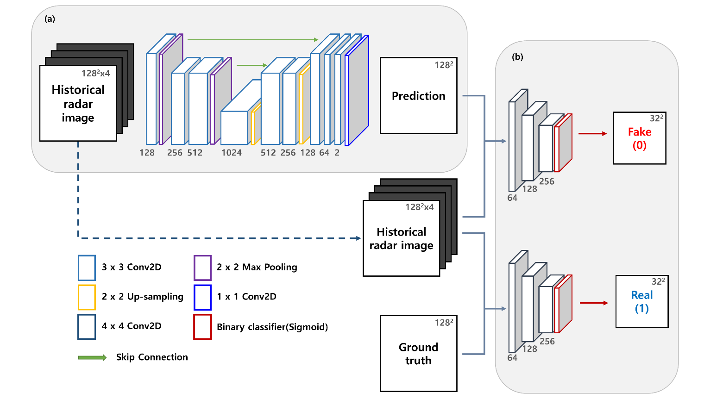

# Rad-cGAN v1.0: Radar-based precipitation nowcasting model with conditional Generative Adversarial Networks for multiple dam domains


## Introduction

Here is the cGAN-based precipitation nowcasting model, named Rad-cGAN, was trained with a radar reflectivity map of the Soyang-gang Dam region in South Korea provided by Korea Meteorological Administration (KMA).

The implementation codes of reference models (U-net,ConvLSTM, and pySTEPS(S-PROG)) were written using [Keras](https://keras.io/)  functional API is in the folder `model`.

The source code and pre-trained Rad-cGAN model is available in Zenodo:
[](https://doi.org/10.5281/zenodo.6650722)


## Model architecture

We developed a Rad-cGAN model using a cGAN framework. Whole architecture is represented in following figure:


### Generator

The model consists of nine convolutional layers, two max-pooling layers, two up-sampling layers, and an output convolutional layer. Each convolutional layer, except for the output layer, is composed of the following operations: 3 × 3 2D convolution with zero-padding, batch normalization, and activation function of ReLU. In the contracting part of the generator, a 2 × 2 2D max-pooling operation was used to down-sample the input images. 

A 2 × 2 2D up-sampling operation was further applied in the expanding part after skip connection to increase the resolution of featured images that contain both high- and low-level information. Finally, the output convolutional layer had a 1 × 1 2D convolution that used a linear function for activation to obtain future prediction of the radar reflectivity image.

### Discriminator

The model consists of three convolutional layers and an output layer. The first two convolutional layers were composed of 4 × 4 2D convolution with strides of two and zero-padding, batch normalization, and ReLU activation function, which was leaky and had a 0.2 slope. The third convolutional layer had the same configuration as the previous layers, except that its stride was 1. To distinguish the input pair in the image form, the output layer consisted of 4 × 4 2D convolution with zero-padding and sigmoid activation functions. 

# Optimization procedure
To optimize Rad-cGAN, we followed the training procedure suggested by [Isola et al. (2017)](https://doi.org/10.48550/arXiv.1611.07004). 

First, we randomly selected samples that consisted of four consecutive radar reflectivity images (t-30, t-20, t-10 min, and t) and the image at t+10 min. 

Second, we created a training sample for the discriminator by adding labels to classify whether the samples were real or fake pairs. 

Next, we updated the parameters of the discriminator using the minibatch stochastic gradient descent (SGD) method for one step. Binary cross-entropy was used as a loss function, and we applied the ADAM optimizer with a learning rate of 0.0002. 
Then, we trained the generator for one step by using cGAN loss (binary cross-entropyloss + 100 * traditional pixel-wise L1 loss). Both the procedures for updating the parameters of the discriminator and generator were run simultaneously during one epoch. 

The pre-trained model was trained using 600 epochs, with a batch size of 8. Also, we applied an early stopping technique which monitoring the generator loss by 100 validation samples randomly sampled from the training dataset.

# Example data

We trained model with a radar reflectivity map of the Soyang-gang Dam region in South Korea with a spatial domain of 128 × 128 km, spatial resolution of 1 km, and temporal resolution of 10 min provided by Korea Meteorological Administration (KMA). 

The example data from 24 August 2018, 02:50 KST(Korea Standard Time) to 24 August 2018, 04:50 KST, when Typoon Soulik landed on the Soyang-gang Dam Basin, are available in Zenodo:
[](https://doi.org/10.5281/zenodo.6460012)

## Example run

To use our model using example data, the following prerequisites.
* Python 3.8+
* Keras 2.3+

GitHub repository:
* `model/generate_data.py`- function to transform data shape into trainable
* `model/minmax_scaler.npy`- (min, max) of train data (i.e., JJA of 2014~2017 at Soyang-gang Dam Basin)

Zenodo repository:
* `example.zip`- example data(.npy) of Typhoon Soulik event
* `Pre-trained model_Soyang-gang.h5`- pretrained model for Soyang-gang Dam Basin

First, transform the example data to trainable shape for our model
```python3
import generate_data
import numpy as np

raw_data=np.load('example/201808240250.npy')
min_max=np.load('minmax_scaler.npy')

# input data shape of function "generate_data" : (no. of samples, rows, cols, time_steps)
# if the raw data consists of one sample, "no. of samples" must be filled with new axis
example_in,example_out=generate_data.generate_data(raw_data[np.newaxis,:],min_max[0],min_max[1])
```

Second, using `keras.models.load_model` function to load pre-trained model
```python3
from keras.models import load_model
 
model = load_model('Pre-trained model_Soyang-gang.h5')
```

Finally, using `predict` function to generate prediction of 10-min lead time from `example_in`
```python3
# prediction shape = (no. of samples, rows, cols, 1)
prediction=model.predict(example_in) 
```


